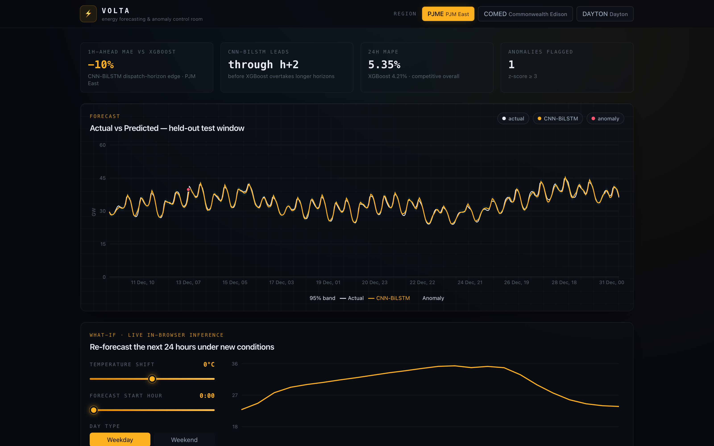
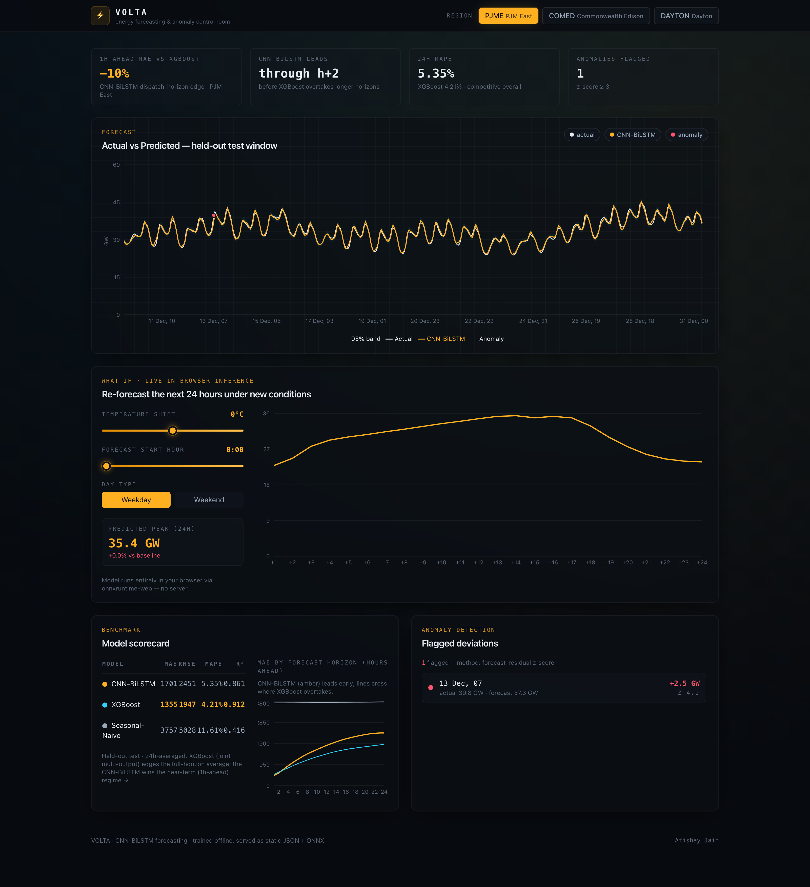

# ⚡ VOLTA — Energy Forecasting & Anomaly Control Room

VOLTA ingests historical hourly energy demand, forecasts the next 24 hours with a
deep-learning **CNN → Bi-LSTM** model, flags anomalies from forecast residuals,
and presents it all in a cinematic, interactive "control-room" dashboard — including
a **what-if simulator that re-forecasts live in your browser** (via `onnxruntime-web`)
as you change temperature, day-type, and hour. No inference server. $0 hosting.

> **Live demo:** https://volta-virid.vercel.app · **Repo:** https://github.com/atishayit/volta



<details>
<summary>Full dashboard (forecast · what-if · scorecard · anomaly view)</summary>



</details>

---

## Headline results

Multi-step (24h-ahead) forecast on a held-out test set, region **PJM East**. Both
the CNN-BiLSTM and the XGBoost baseline are **joint multi-output** models (they emit
the whole 24-hour vector at once), so the comparison is structurally like-for-like.

| Model | MAE (MW) | RMSE (MW) | MAPE | R² |
|---|---:|---:|---:|---:|
| CNN-BiLSTM | 1701 | 2451 | 5.35% | 0.861 |
| XGBoost (joint multi-output) | 1355 | 1947 | 4.21% | 0.912 |
| Seasonal-Naive | 3757 | 5028 | 11.61% | 0.416 |

**The story is in the horizon, not the average.** The CNN-BiLSTM **wins the
dispatch-critical near-term horizon**, where real-time grid balancing happens:

- **−10% MAE at h+1 (1-hour-ahead)** vs XGBoost on PJM East — and it wins h+1 in
  **all three zones** (PJME −10%, COMED −15%, DAYTON −10%).
- **Leads through h+2** before XGBoost's lag/rolling features overtake further out.
- Both crush the seasonal-naive baseline (**−55% MAE**).

Beyond a few hours XGBoost edges the 24h-averaged MAPE (4.21% vs 5.35%) — a
well-documented strength of gradient-boosted trees on regular hourly load. VOLTA
reports this honestly: the per-horizon chart in the dashboard shows exactly where the
two models cross. Numbers are generated by the pipeline below (`metrics.json`).

---

## Architecture

```
[offline pipeline: Python]                         [Next.js static export: Vercel]
  data.py      synth/real hourly load + weather       reads /public/data/*.json
  features.py  time feats, lags, rolling stats   ┌──►   • hero forecast chart
  train.py     CNN-BiLSTM (PyTorch) ── model.pt  │      • model scorecard
  baselines.py XGBoost + seasonal-naive          │      • anomaly timeline
  export.py    ── model.onnx ─────────────────┐  │
               ── forecasts/metrics/...json ───┴──┘    onnxruntime-web runs
                                                       model.onnx IN-BROWSER
                                                       for the what-if simulator
```

- **Train offline, ship static.** The model is trained on CPU, exported to ONNX,
  and the test-set predictions/metrics are dumped to JSON. The web app is a pure
  static export.
- **Interactive inference is client-side.** The what-if simulator loads
  `model.onnx` and runs it in the browser with `onnxruntime-web` (WASM) — the
  forecast curve updates live with zero backend.

## Dataset — real, end to end

VOLTA trains on **real data**, assembled reproducibly with no API keys by
`ml/fetch_real_data.py`:

- **Load** — PJM Interconnection hourly demand (MW), 2015–2017, for three zones:
  **PJME** (PJM East), **COMED** (Commonwealth Edison), **DAYTON**. Source: Kaggle
  [`robikscube/hourly-energy-consumption`](https://www.kaggle.com/datasets/robikscube/hourly-energy-consumption)
  (public GitHub mirror).
- **Weather** — real hourly 2 m temperature from the free, key-less
  [Open-Meteo archive API](https://open-meteo.com/), pulled for each zone's
  representative city (Philadelphia / Chicago / Dayton) and aligned to the load
  timestamps. Temperature shows the expected U-shaped relationship with demand.

`fetch_real_data.py` downloads the load CSVs + fetches weather and writes
`ml/artifacts/energy.csv` (`datetime, region, load_mw, temperature, is_holiday,
is_anomaly`). A synthetic generator (`data.py`) provides an identical-schema
fallback so the pipeline also runs fully offline with **no downloads**.

## The model (M-BDLSTM)

A compact 1-D CNN feature extractor feeding a **bidirectional LSTM** and a dense
head that emits the full 24-hour forecast at once (direct multi-step). Kept small
so it trains on CPU in minutes and exports to a lean ONNX graph that runs in-browser.

- **Input:** 168h (1 week) window × 8 feature channels (load, temperature, cyclical
  hour/day-of-week, weekend, holiday) — all z-scored per region.
- **Output:** 24 hours ahead.
- **Read-out:** last-step ⊕ mean ⊕ max pooling over the BiLSTM sequence.
- **Daily-seasonal skip:** the head predicts a *correction* to same-hour-yesterday
  (the load channel of the window's last 24 steps), which sharpens multi-step
  forecasts and lets the network focus on deviations from the daily pattern.
- **Training:** one model pooled across all regions in z-scored space (3× data
  regularises better than per-region specialists); cosine LR, ~18 epochs on CPU.

## Run the pipeline

```bash
# 1. Python env (uses numpy/pandas/sklearn/torch/xgboost/onnx)
pip install numpy pandas scikit-learn torch xgboost holidays onnx

cd ml
python fetch_real_data.py  # real PJM load + Open-Meteo temperature -> energy.csv
#   (or: python data.py   to use the synthetic fallback, no downloads)
python train.py            # train CNN-BiLSTM (PyTorch), eval hero + seasonal-naive
python baselines.py        # XGBoost baseline (separate process — see note)
python export.py           # -> web/public/{models/model.onnx, data/*.json}
```

> **macOS note:** PyTorch and XGBoost each bundle their own OpenMP runtime and
> **deadlock if imported in the same process**. That's why `baselines.py` is a
> separate, torch-free script. Run the steps in order.

## Run the web app

```bash
cd web
npm install
npm run dev        # http://localhost:3000
npm run build      # static export -> web/out
```

## Deploy (free)

Vercel → import the repo → set **Root Directory = `web`**. The static export and
the in-browser ONNX inference run entirely on the free tier (WASM is loaded from a
CDN). No server, no GPU, no paid APIs.

## Repo structure

```
volta/
  ml/                 # data, features, model, training, export
  notebooks/          # EDA / training walkthrough
  web/                # Next.js 14 (App Router, TS, Tailwind) static dashboard
    app/  components/  lib/
    public/data/      # forecasts.json, metrics.json, anomalies.json, ...
    public/models/    # model.onnx
  README.md
```

---

Built by **Atishay Jain**.
